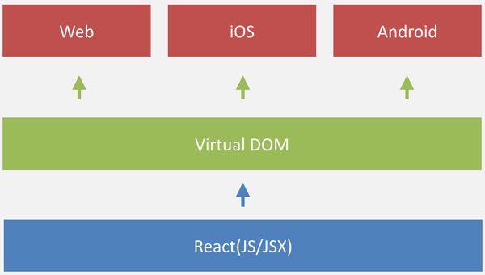

#### React Native

RN 这套框架让 JS开发者可以大部分使用JS代码就可以构建一个跨平台APP。 Facebook官方说法是learn once, run everywhere， 即在android 、 ios、 Browser各个平台，程序画UI和写逻辑的方式都大致相同。因为JS 可以动态加载，从而理论上可以做到write once, run everywhere， 当然要做额外的适配处理。如图：

#### 运行原理

RN需要一个JS的运行环境， 在**IOS上直接使用内置的JavaScript Core**， 在**Android 则使用webkit.org官方开源的jsc.so**。 此外还集成了其他开源组件，如fresco图片组件，okhttp网络组件等。

RN 会把应用的JS代码（包括依赖的framework）编译成一个js文件（一般命名为index.android.bundle), , RN的整体框架目标就是为了解释运行这个js 脚本文件，如果是js 扩展的API， 则直接通过bridge调用native方法; 如果是UI界面， 则映射到virtual DOM这个虚拟的JS数据结构中，通过bridge 传递到native ， 然后根据数据属性设置各个对应的真实native的View。 bridge是一种JS 和 Java代码通信的机制， 用bridge函数传入对方module 和 method即可得到异步回调的结果。

对于JS开发者来说， 画UI只需要画到virtual DOM 中，不需要特别关心具体的平台, 还是原来的单线程开发，还是原来HTML 组装UI（JSX），还是原来的样式模型（部分兼容 )。RN的界面处理除了实现View 增删改查的接口之外，还自定义一套样式表达CSSLayout，这套CSSLayout也是跨平台实现。 RN 拥有画UI的跨平台能力，主要是加入Virtual DOM编程模型，该方法一方面可以照顾到JS开发者在html DOM的部分传承， 让JS 开发者可以用类似DOM编程模型就可以开发原生APP ， 另一方面则可以让Virtual DOM适配实现到各个平台，实现跨平台的能力，并且为未来增加更多的想象空间， 比如react-cavas, react-openGL。而实际上react-native也是从react-js演变而来。

#### 对于 Android 开发者

RN是一个普通的安卓程序加上一堆事件响应， 事件来源主要是JS的命令。

主要有二个线程，UI main thread, JS thread。 

* UI thread创建一个APP的事件循环后，就挂在looper等待事件 , 事件驱动各自的对象执行命令。 
* JS thread 运行的脚本相当于底层数据采集器， 不断上传数据，转化成UI 事件， 通过bridge转发到UI thread, 从而改变真实的View。 

后面再深一层发现， UI main thread 跟 JS thread更像是CS 模型，JS thread更像服务端， UI main thread是客户端， UI main thread 不断询问JS thread并且请求数据，如果数据有变，则更新UI界面。

#### 对于 iOS 开发者

Objective-C 创建了一个单独的线程，这个线程只用于执行 JavaScript 代码，而且 JavaScript 代码只会在这个线程中执行。

##### JavaScript 调用 Objective-C

1. **寻找Native Method:** 在 Objective-C 和 JavaScript 两端都保存了一份配置表(OC端和JS端分别各有一个bridge，两个bridge都保存了同样一份模块配置表)，里面标记了所有 Objective-C 暴露给 JavaScript 的模块和方法。这样，无论是哪一方调用另一方的方法，实际上传递的数据只有 ModuleId、MethodId 和 Arguments 这三个元素，它们分别表示类、方法和方法参数，当 Objective-C 接收到这三个值后，就可以通过 runtime 唯一确定要调用的是哪个函数，然后调用这个函数。
2. **执行 JavaScript 回调:** 在 JavaScript 调用 Objective-C 代码时，注册要回调的 Block，并且把 BlockId 作为参数发送给 Objective-C，Objective-C 收到参数时会创建 Block，调用完 Objective-C 函数后就会执行这个刚刚创建的 Block。Objective-C 会向 Block 中传入参数和 BlockId，然后在 Block 内部调用 JavaScript 的方法，随后 JavaScript 查找到当时注册的 Block 并执行

例如-`(void)select:(int)index response:(RCTResponseSenderBlock)callback` 这个方法，拿到两个参数的类型为int,block，JS传过来的两个参数类型是NSNumber,NSString(CallbackID)，这时会把NSNumber转为int，NSString(CallbackID)转为一个block，block的内容是把回调的值和CallbackID传回给JS。

##### Objective-C调用JavaScript

实际上模块配置表除了有上述OC的模块remoteModules外，还保存了JS模块localModules，OC调JS某些模块的方法时，也是通过传递ModuleID和MethodID去调用的，都会走到-`enqueueJSCall:args:`方法把两个ID和参数传给JS `BatchedBridge.callFunctionReturnFlushedQueue`，跟JS调OC原理差不多，就不再赘述了。

#### JS是怎样把数据传给OC，让OC去调相应方法的？

答案是通过返回值。**JS不会主动传递数据给OC**，在调OC方法时，会在上述第4步把ModuleID,MethodID等数据加到一个队列里，等OC过来调JS的任意方法时，再把这个队列返回给OC，此时OC再执行这个队列里要调用的方法。

