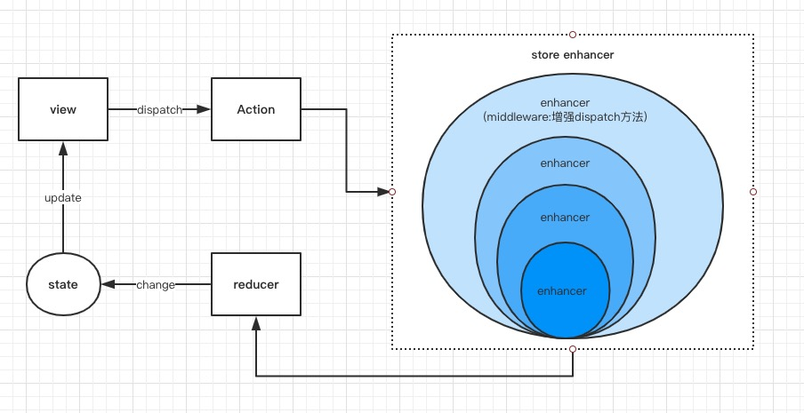

#### react redux

redux是参考Flux设计原则的一个管理数据流的库。

下图为redux的核心运作流程




redux 三大原则： 

* 单一数据源：整个应用的状态都保存在一个对象（store）中。这样我们随时可以取出整个应用的状态进行持久化。
* 状态只读：不允许直接修改状态（必须通过 dispatch action来修改状态）
* 纯函数reducer：状态修改为一个纯函数（接受一定的输入，必定会得到一定的输出）完成。

#### 1. Redux核心API

Redux的核心是一个store - 存储状态。

```
import {createStore} from 'redux';

const store = createStore(reducers, initialState);
```

store是一个对象，包含4个方法：
* getState()：获取store中当前的状态
* dispatch(action)：分发一个action，并返回这个action，这是唯一能改变store中数据的方式
* subscribe(listener)：注册一个监听者，它在store发生变化时调用
* replaceReducer(nextReducer)：更新当前store里面的reducer，一般只会在开发模式中调用该方法

我们只需要关注 getState() 和 dispatch(action) 即可。

#### 2. 与React绑定使用

使用`react-redux`库。

#### 3. Redux middleware

Redux 提供了 `applyMiddleware`方法来加载 middleware。

每个middleware处理一个相对独立的业务需求，通过串联不同的middleware实现变化多样的功能。

```
export default function applyMiddleware(...middlewares) {

  return (createStore) => (reducer, preloadedState, enhancer) => {
    const store = createStore(reducer, preloadedState, enhancer)
    // 存旧的dispatch 
    let dispatch = store.dispatch  
    let chain = [];

    const middlewareAPI = {
        getState: store.getState,
        // 利用匿名函数包裹dispatch。
        dispatch: (action) => dispatch(action)
    }

    chain = middlewares.map(middleware => middleware(middlewareAPI));
    //生成新的dispatch
    // compose 是函数式编程中的组合，它将 chain 中的所有匿名函数`[f1, f2, ... , fx, ..., fn]`组装成一个新的函数，
    // 即新的dispatch。
    // 多个middleware调用结果为：`dispatch = f1(f2(f3(store.dispatch))))`;
    dispatch = compose(...chain)(store.dispatch);    
    // 返回改写过disptach的store
    return {
      ...store,
      dispatch
    }
  }
}

// 利用applyMiddleware创建新的store。
let newStore = applyMiddleware(mid1, mid2, mid3, ...)(createStore)(reducer, null);
```

##### 在middleware中调用next(action)和store.dispatch(action)

* 在middleware中调用next()，可以进入下一个middleware
* 在middleware中调用store.dispatch()，会跳出middleware流，重新开始。


如上图，分发一个action时，middleware通过next(action)一层层处理和传递action到Redux原生的dispatch。

如果某个middleware使用store.dispatch(action))分发action，会跳出middleware管道，重新再来。

##### store.dispatch(action)的应用场景

**action默认都是同步的**。如果是一个异步Action（异步请求），那么需要一个专门处理异步请求的middleware，这是会用到store.dispatch()。

比如redux-thunk：
```
const thunk = store =>next => action =>
    typeof action === 'function' ? action(store.dispatch, store.getState) : next(action)
```

异步Acton设计如下：发起异步请求，如果成功，弹出成功弹框，否则，弹出错误弹框。
```
const getThenShow = (dispatch, getState) =>{
    const url = 'http://xxx.json';

    fetch(url)
        .then(response=>{
            dispatch({
                type: 'SHOW_MESSAGE_SUCCESS',
                message: response.json
            })
        })
        .catch(error=>{
            dispatch({
                type: 'SHOW_MESSAGE_FAIL',
                message: 'error'
            })
        })
}
```

#### 4. Redux性能优化

1) 使用react-redux

在使用react-redux的connect函数时，实际上产生了一个无名的React组件类，这个类定制了shouldComponentUpdate函数的实现，实现逻辑时对比这次传递给内层傻瓜组件的props和上次的props。如果props没有变化，那内层组件无需再次渲染。

```
import {connect} from 'react-redux';

const Foo = ({text})=>(
    <div>{text}</div>
)

const mapStateToProps = (state)=> (
    text: state.text
)

// connect函数返回了一个容器组件，会实现shouldComponentUpdate函数，判断这次的text和上一次text的值是否相等。
export default connect(mapStateToProps)(Foo);
```

connect函数中采用浅比较，即 value1 == value2


2）用reselect提高数据获取性能

工作原理：只要相关状态没有改变，就直接使用上一次的缓存结果。

reselect把计算过程分为两个步骤：

**步骤1**: 从输入参数state抽取第一层结果，第一层结果和之前抽取的第一层结果做比较（===比较），如果发现完全相同，就不会进入第二步计算，选择器直接把之前第二部分的运输结果返回。

**步骤2**: 根据第一层结果计算出选择权需要返回的最终结果。

定义选择器：
```
import { createSelector } from 'reselect'

const getVisibilityFilter = (state) => state.visibilityFilter
const getTodos = (state) => state.todos

export const getVisibleTodos = createSelector(
  [ getVisibilityFilter, getTodos ],
  (visibilityFilter, todos) => {
    switch (visibilityFilter) {
      case 'SHOW_ALL':
        return todos
      case 'SHOW_COMPLETED':
        return todos.filter(t => t.completed)
      case 'SHOW_ACTIVE':
        return todos.filter(t => !t.completed)
    }
  }
)
```

使用新定义的选择器：

```
import {getVisibleTodos} from './selector.js'

const mapStateToProps = (state) => {
    return {
        todos: getVisibleTodos(state);
    }
}
```

3）Immutable Redux

持久化数据结构，结构共享，惰性操作。

通过Immutable.js创建的对象在任何情况下都无法被修改，这样可以防止由于开发者的粗心导致直接修改Redux的state。

#### 5. 合理 connect 场景

在使用 Redux 时，我们搭配 React-redux 来对组件和数据进行联通（connect），一个常陷入的误区就是滥用connect，而没有进行更合理的设计分析。也可能只在顶层进行了 connect 设计，然后再一层层进行数据传递。

如果只对 Page 这个顶层组件进行 connect 设计，其他组件的数据依靠 Page 组件进行分发，则设计如图所示：


这样做存在的问题如下：

  * 当改动 Profile 组件中的用户头像时，由于数据变动整个 Page 组件都会重新渲染；
  * 当删除 Feeds 组件中的一条信息时，整个 Page 组件也都会重新渲染；
  * 当在 Images 组件中添加一张图片时，整个 Page 组件同样都会重新渲染。

因此，更好的做法是对 Profile、Feeds、Images 这三个组件分别进行 connect 设计，在 connect 方法中使用
mapStateToProps 筛选出不同组件关心的 state 部分，如图所示：


这样做的好处很明显：

  * 当改动 Profile 组件中的用户头像时，只有 Profile 组件重新渲染；
  * 当删除 Feeds 组件中的一条信息时，只有 Feed 组件重新渲染；
  * 当在 Images 组件中添加一张图片时，只有 Images 组件重新渲染。

#### 