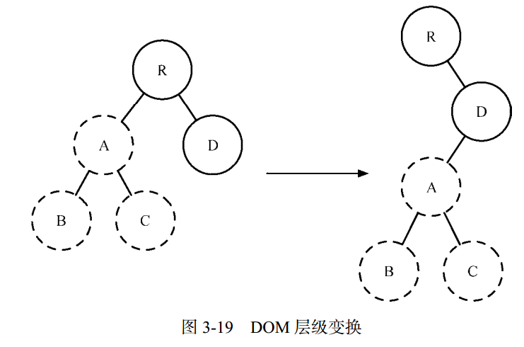

#### diff算法

如何计算Virtual Dom中真正变化的部分，这就需要diff算法。

Virtual Dom配合高效的diff算法，才能够快速的渲染改动的页面，而不会渲染整个页面。

#### 1. 跨层级移动

策略：针对节点进行比较。不同层级的节点，只有创建和删除操作。

**影响性能操作，建议不要进行DOM 节点跨层级的操作**。

图示如下（`create A →create B →create C →delete A`）：

#### 2. 同层级父节点移动

策略：
1. 同类型组件：通过 `shouldComponentUpdate()` 来判断该组件是否需要进行diff 算法分析（所以可以利用`shouldComponentUpdate()`来优化组件性能）
2. 不同类型组件：直接判断为dirty component，从而替换整个组件下的所有子节点

图示如下：

#### 3. 同层级子节点移动

策略：对于同一层级的一组子节点，它们可以通过唯一 **id** 进行区分（这就是为什么在批量创建同类型组件时需要添加`key`属性，并且建议将`key`定义为有意义的唯一标示，而不是`index`索引）。

其提供三种操作方法：

* **INSERT_MARKUP**：新的组件类型不在旧集合里，即全新的节点，需要对新节点执行插入操作
* **MOVE_EXISTING**：旧集合中有新组件类型，且element 是可更新的类型generateComponentChildren 已调用 receiveComponent，这种情况下 prevChild=nextChild，就需要做移动操作，可以复用以前的DOM 节点。
* **REMOVE_NODE**：旧组件类型，在新集合里也有，但对应的element 不同则不能直接复用和更新，需要执行删除操作，或者旧组件不在新集合里的，也需要执行删除操作。

