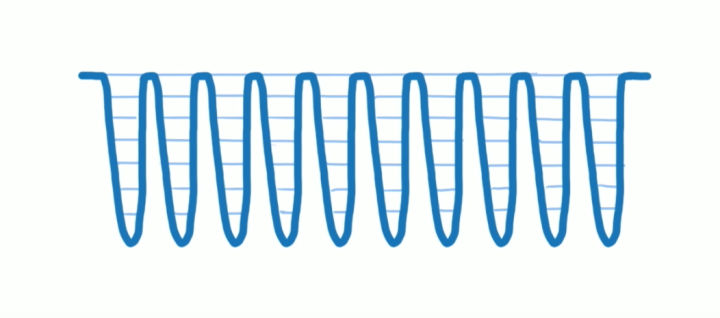
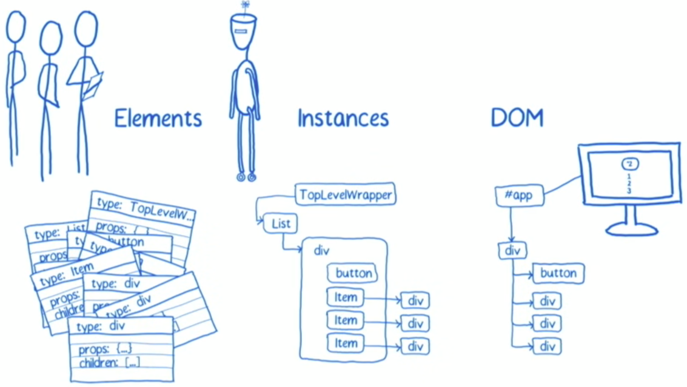
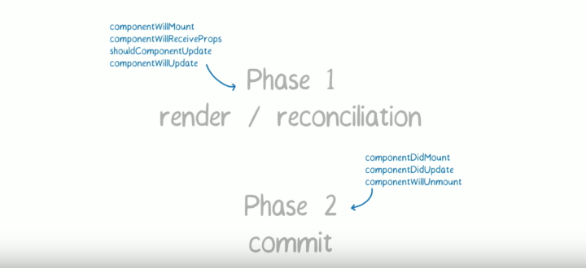

#### React Fiber

**“React Fiber是对核心算法的一次重新实现” **

在V16之前，React的更新过程是同步的，这可能会导致性能问题。

比如，当React决定要加载或者更新组件树时，会做很多事，比如调用各个组件的生命周期函数，计算和比对Virtual DOM，最后更新DOM树，这整个过程是同步进行的，也就是说只要一个加载或者更新过程开始，那React就以不破楼兰终不还的气概，一鼓作气运行到底，中途绝不停歇。

也就是说，一旦加载或更新的生命周期开始，生命周期钩子函数会依次调用，知道更新DOM UI。

问题：

一旦出现一个非常耗时的组件更新操作，那么，浏览器处理JS的唯一线程就只能专注在这个组件的更新操作上。如果此时用户点击按钮或者做输入操作，浏览器将没有任何反应。直到组件更新完毕后，刚才的操作才有反应结果。

这种界面卡顿是极其不友好的，所以React V16采用了“分片”策略。

#### React Fiber的方式

把一个耗时长的任务分成很多**小片（维护每一个分片的数据结构，就是Fiber）**，每一个小片的运行时间很短，虽然总时间依然很长，但是在每个小片执行完之后，都给其他任务一个执行的机会，这样唯一的线程就不会被独占，其他任务依然有运行的机会。

有了分片之后，更新过程的调用栈如下图所示，中间每一个波谷代表深入某个分片的执行过程，每个波峰就是一个分片执行结束交还控制权的时机。



fiber一个对象，表征reconciliation阶段所能拆分的最小工作单元，和下图中的react instance一一对应。



```
fiber {
    stateNode: {},// 管理Instance自身的特性
    child: {}, //当前工作单元
    sibling: {},//下一个工作单元
    return: {},//处理完成后返回结果所要合并的目标，通常指向父节点
}
```

#### React Fiber对生命周期的影响

以前，生命周期钩子函数只会在一次更新操作中调用一次，但是V16之后，某些函数可就不仅仅只调用一次了。

因为一个更新过程可能被打断，所以React Fiber一个更新过程被分为两个阶段(Phase)：

* 第一个阶段Reconciliation Phase（可能被打断），调用的生命周期函数为：
    * componentWillMount
    * componentWillReceiveProps
    * shouldComponentUpdate
    * componentWillUpdate
* 第二阶段Commit Phase（不会被打断，一气呵成），调用的生命周期函数为：
    * componentDidMount
    * componentDidUpdate
    * componentWillUnmount



比如说，一个低优先级的任务A正在执行，已经调用了某个组件的componentWillUpdate函数，接下来发现自己的时间分片已经用完了，于是冒出水面，看看有没有紧急任务，哎呀，真的有一个紧急任务B，接下来React Fiber就会去执行这个紧急任务B，任务A虽然进行了一半，但是没办法，只能完全放弃，等到任务B全搞定之后，任务A重头来一遍，也就是说，componentWillUpdate函数会被再调用一次。

由于**第一个阶段可能的生命周期函数在一次加载和更新过程中可能会被多次调用**，所以保证期间运行的都是纯函数（给出同样的参数值，该函数总是求出同样的结果）。

#### 例子

有个很好的例子可以参考：https://juejin.im/post/5ab7b3a2f265da2378403e57#heading-4


