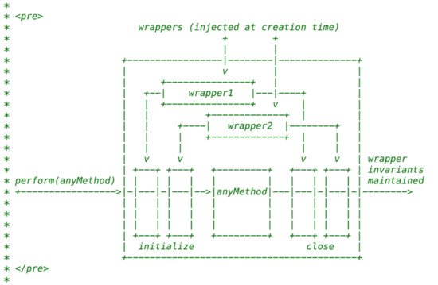
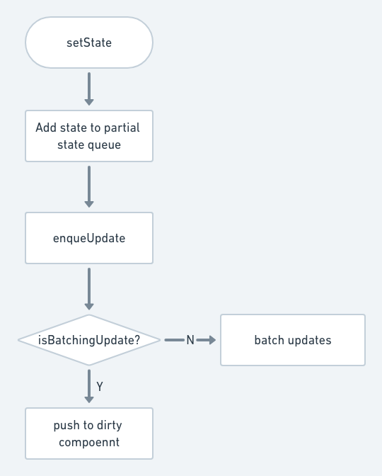
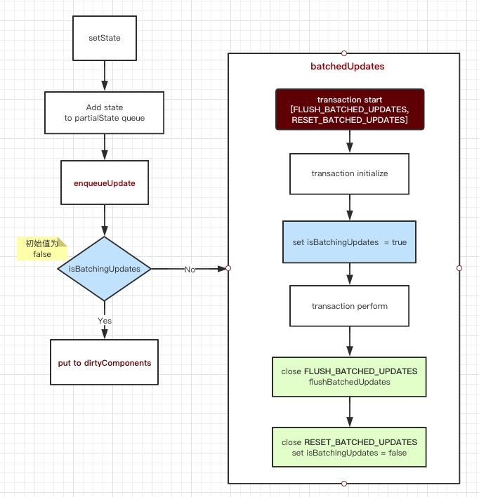

#### 事务-Transaction

#### 1. 何为事务？

根据维基百科的解释: 提供独立可靠的恢复机制，保证出错时数据的一致性，不同事务之间互相独立。

事务一般在 **数据库** 中使用的比较多，能保证出错的时候进行rollbakc恢复。但是，React中的事务并不提供类似数据库的回滚能力。

React中的事务-Transaction就是一个包装函数，函数被包装为一个个wrapper，其中每个wrapper都有两个方法：`initialize`与`close`。当执行方法时，需要执行事务的`perform`方法。`perform`方法会首先一次执行wrapper的`initialize`，然后执行函数本身，最后执行wrapper的`close`方法。



#### 2. 从setState看事务的应用

**React does not guarantee that the state changes are applied immediately**

**setState不一定是同步的**

```
class Demo extends Component {
    state = {
        count: 1
    }

    onClickHandler = ()  => {
        this.setState({count: this.state.count + 1});
        console.log(this.state.count); // console.log 结果 1
        this.setState({count: this.state.count + 1});
        console.log(this.state.count); // console.log 结果 1

        setTimeout(() => {
            this.setState({count: this.state.count + 1});
            console.log(this.state.count); // console.log 结果 2
            this.setState({count: this.state.count + 1});
            console.log(this.state.count); // console.log 结果 3
        }, 0);
    }

    render() {
        const { count } = this.state;
        return (
            <button onClick={this.onClickHandler}>{count}</button>
        );
    }
}
```

上面的例子中，直接调用setState后，state并未立刻更新，但是，如果通过setTimeout异步调用后，state会立刻更新，为什么呢？

##### setState的实现　

1）setState是React.Component的方法

```
function ReactComponent(props, context, updater) {
  this.props = props;
  this.context = context;
  this.refs = emptyObject;
  this.updater = updater || ReactNoopUpdateQueue;
}

ReactComponent.prototype.setState = function (partialState, callback) {
  this.updater.enqueueSetState(this, partialState); // state入队列
  if (callback) {
    this.updater.enqueueCallback(this, callback); // callback入队列
  }
};
```

2）判断当前组件对象的state更新队列是否存在，如果存在则将partialState也就是新的state值加入队列；如果不存在，则创建该对象的更新队列。

```
var ReactUpdatedQueue = {
  enqueueSetState: function (publicInstance, partialState) {
    var internalInstance = getInternalInstanceReadyForUpdate(publicInstance, 'setState');

    if (!internalInstance) {
      return;
    }

    var queue = internalInstance._pendingStateQueue 
                || (internalInstance._pendingStateQueue = []);
    queue.push(partialState); // 入队列

    enqueueUpdate(internalInstance); // 队列更新
  },
}
```

3）当`batchingStrategy.isBatchingUpdates`为`false`时，将执行`batchedUpdates`更新队列，若为`true`时，则将组件放入`dirtyComponent`中。

```
var ReactUpdates = {
    enqueueUpdate: function enqueueUpdate(component) {
        ensureInjected();
        // batchingStrategy是一种批量更新策略
        if (!batchingStrategy.isBatchingUpdates) {
            batchingStrategy.batchedUpdates(enqueueUpdate, component);
            return;
        }
        
        dirtyComponents.push(component);
    }
}
```

截止到此，setState流程如下：




4）`batchingStrategy`是干什么的？看一下该对象类型`ReactDefaultBatchingStrategy`的定义。

```
var ReactDefaultBatchingStrategy = {
  isBatchingUpdates: false,
  // 执行批量更新的方法
  batchedUpdates: function(callback, a, b, c, d, e) {
    var alreadyBatchingUpdates = ReactDefaultBatchingStrategy.isBatchingUpdates;
    ReactDefaultBatchingStrategy.isBatchingUpdates = true;
    if (alreadyBatchingUpdates) {
      callback(a, b, c, d, e);
    } else {
      // 事务出现了！！！这里是事务的执行阶段  
      transaction.perform(callback, null, a, b, c, d, e); 
    }
  },
};
```

5）ReactDefaultBatchingStrategy中的transaction是如何定义的？
```
// 第二个事务 - 更改isBatchingUpdates布尔值，合并state改变
var RESET_BATCHED_UPDATES = {
  initialize: emptyFunction,
  close: function() {
    ReactDefaultBatchingStrategy.isBatchingUpdates = false;
  },
};

// 第一个事务 - 更新组件
var FLUSH_BATCHED_UPDATES = {
  initialize: emptyFunction,
  close: ReactUpdates.flushBatchedUpdates.bind(ReactUpdates),
};

var TRANSACTION_WRAPPERS = [FLUSH_BATCHED_UPDATES, RESET_BATCHED_UPDATES];

function ReactDefaultBatchingStrategyTransaction() {
  this.reinitializeTransaction();
}

Object.assign(
  ReactDefaultBatchingStrategyTransaction.prototype,
  Transaction.Mixin,
  {
    getTransactionWrappers: function() {
      return TRANSACTION_WRAPPERS;
    },
  }
);

var transaction = new ReactDefaultBatchingStrategyTransaction();
```

其中`wrapper` `RESET_BATCHED_UPDATES`负责在`close`阶段重置`ReactDefaultBatchingStrategy`的`isBatchingUpdates`为`false`。而`wrapper` `FLUSH_BATCHED_UPDATES`负责在`close`执行`flushBatchedUpdates`。

两个事务的运行次序为 `FLUSH_BATCHED_UPDATES, RESET_BATCHED_UPDATES]`。

由此，在上图中添加`batchedUpdates`中的事务操作后，流程图如下：



#### 2.再回头看看我们之前的问题

**在使用React封装的事件时会进入一个事务，使得 isBatchingUpdate 为 true 。**

所以，随后的setState在调用时会进入 dirtyComponent 队列，在下一次batch update中进行更新。所以在下一次batch update之前， this.state 都不会得到更新。

如果 setState 函数进行了 setTimeout 的包裹，由于EventLoop的特点，会保证 setState 一定是在前一条message之后，也就是上一次batch update完之后进行执行， isBatchingUpdate 为 false，此时的 setState 会直接触发一次完整的batch update，保证 this.state 被同步更新。

#### 3. 还有什么方式可以同步更新state？

 当我们使用原生的事件机制时（比如 addEventListener ），由于缺少了React的封装，会使得 setState 直接触发 batch update更新，从而同步更新state。

```
componentDidMount() {
   document.querySelector('#foo').addEventListener('click', () => {
     this.setState({count: this.state.count + 1});
     console.log(this.state.count);
     this.setState({count: this.state.count + 1});
     console.log(this.state.count);
     })
  }
```